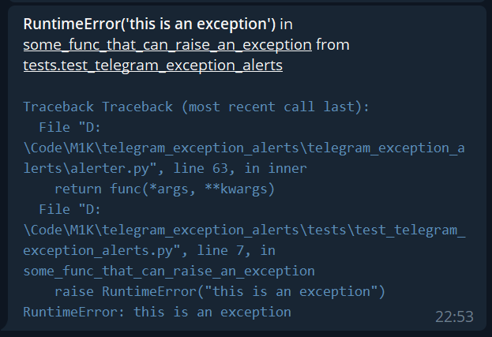

# Telegram Exception Alerts
[](https://github.com/psf/black)
[](https://pypi.org/project/telegram-exception-alerts/)


A very lightweight library for sending exception details to Telegram using a decorator.

## Installation

```bash
pip install telegram-exception-alerts
```
or
```bash
poetry add telegram-exception-alerts
```

## Usage

After you initialize the alerter instance you can attach the decorator to any function. If it 
raises an exception information will be send to the chat specified in `chat_id` (don't forget 
that if you want to send notification to a channel you need to prepend that `chat_id` with `-100`).

### Normal initialization

```python
from telegram_exception_alerts import Alerter

tg_alert = Alerter(bot_token='YOUR_BOT_TOKEN', chat_id='YOUR_CHAT_ID')

@tg_alert
def some_func_that_can_raise_an_exception():
    raise RuntimeError('this is an exception')
```

### Initialization from environment (recommended)

You can also initialize the alerter from environment variables. **This is the recommended way**
because it will make sure you're not committing sensitive information to the repo.

* `ALERT_BOT_TOKEN` - your bot token
* `ALERT_CHAT_ID` - your chat id to receive notifications

```python
from telegram_exception_alerts import Alerter

tg_alert = Alerter.from_environment()

@tg_alert
def some_func_that_can_raise_an_exception():
    raise RuntimeError('this is an exception')
```

Here's what a telegram message from an example above looks like:



## Sending messages
You can also use the `Alerter` as a simple way to send messages to Telegram:

```python
from telegram_exception_alerts import Alerter

tg_alert = Alerter.from_environment()

tg_alert.send_message(chat_id=111222333, text='Message text')
```

For real bot programming I highly recommend the excellent [python-telegram-bot](https://python-telegram-bot.org/) library.
